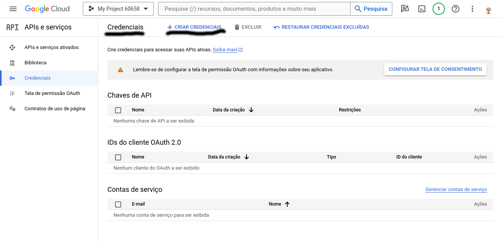
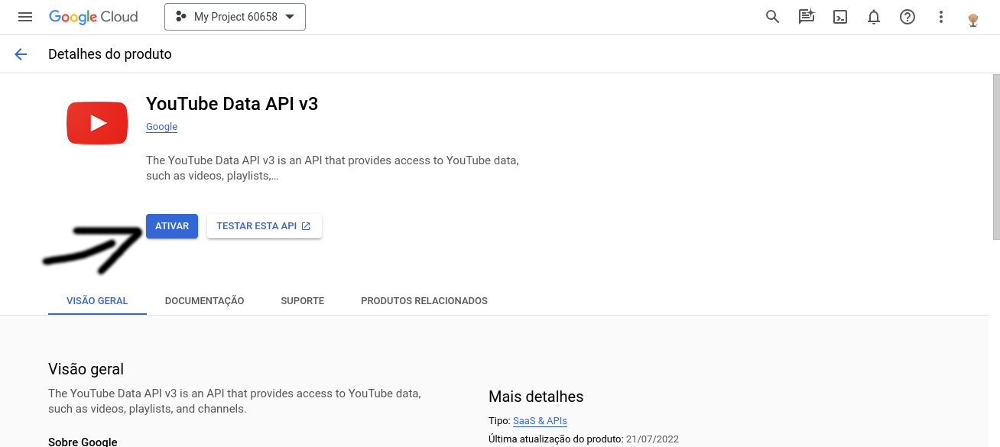

[](https://www.gnu.org/licenses/old-licenses/gpl-2.0.en.html)


```
                                                              _            
                 _                               _           | |           
    ___   _   _ | |_   ___  _   _   ___   _   _ | |_   _   _ | | _    ____ 
   / _ \ | | | ||  _) (___)| | | | / _ \ | | | ||  _) | | | || || \  / _  )
  | |_| || |_| || |__      | |_| || |_| || |_| || |__ | |_| || |_) )( (/ / 
   \___/  \____| \___)      \__  | \___/  \____| \___) \____||____/  \____)
                           (____/                                          

```

Esse script baixa(download) todo conteúdo de um canal no youtube.
- Vídeo
- legenda
- legenda automática (youtube)
- Gera apenas um arquivo mp3 do vídeo
- capa dos vídeos
- capa do canal
- quantidades de vídeos
- quantidades de visualizações
- playlist com todos os vídeos
- Data de criação do canal
- Duração de cada vídeo
- Muito mais

Ele baixa apenas vídeos Live(streaming) terminadas.


## Dependências:
`ffmpeg` - https://www.ffmpeg.org/download.html <br />
`yt-dlp` - https://ytdl-org.github.io/youtube-dl/download.html <br />
`jq` - https://stedolan.github.io/jq/download/ <br />
`wget` - https://www.gnu.org/software/wget/ <br />

Para instalar em (Debian, Ubuntu, Mint):
- `apt-get install ffmpeg jq wget pip`
- `python3 -m pip install -U yt-dlp`


## Uso da ferramenta
A ferramenta gera um arquivo de configuração para cada canal. 

```
    out-youtube.sh out <directório>
```
<directório>: É para criar um novo diretório para um novo canal com out-config. 

Isso irá gerar um arquivo de configuração `out-config`. Nele deve inserir as configurações para o canal do youtube. O `<diretório>` será criado se não existir. Para mais informações leia o arquivo `out-config` depois de criado.
Opções no out-config:
- API_KEY: Informações da chave de acesso do google para o youtube
- ID_VIDEO: Link do vídeo do canal que deve fazer download. Através desse vídeo obterá o canal.
- DIRECTORY: O caminho aonde deve colocar os downloads do canal.
- VIDEO: true ou false. Deve baixar os vídeos ou não
- AUDIO: true ou false. Deve ter o áudio do vídeo em mp3.
- SUBTITLE: true ou false. Deve baixar legenda
- AUTO_SUBTITLE: true ou false. Deve baixar legenda gerado automaticamente.
- LANGUAGE: As legendas(caption) que deve baixar 
Leia o arquivo out-config para mais informações.

Depois que essas informações no `out-config` forem preenchidas, deve executar `out-youtube.sh` como o caminho para o out-config.

`out-youtube.sh`: O programa vai procurar o out-config no diretório atual\
`out-youtube.sh /home/user/canal_youtube/`: Procura o out-config dentro de /home/user/canal_youtube/

O `out-youtube.sh` executará de acordo com out-config colocado para um canal.

### E se o canal tiver novos vídeos?
Só executar o out-youtube.sh com out-config do canal que ele vai atualizar e, se precisar, baixar novos vídeos.

### Como crio um chave no youtube do google
[Link gerar](https://console.cloud.google.com/apis/credentials) para criar chave do google para colocar no out-config. Vá em bibliotecas e ativa para API-KEY para `Youtube Data API v3`. 





